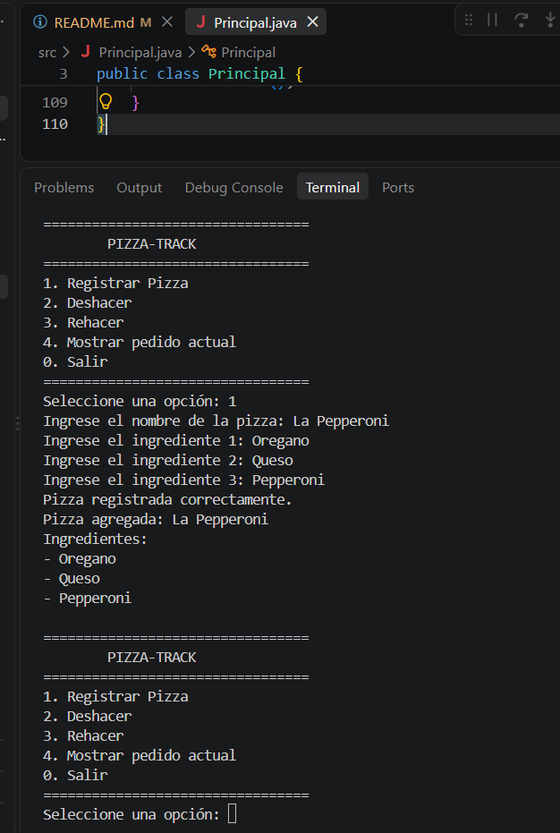
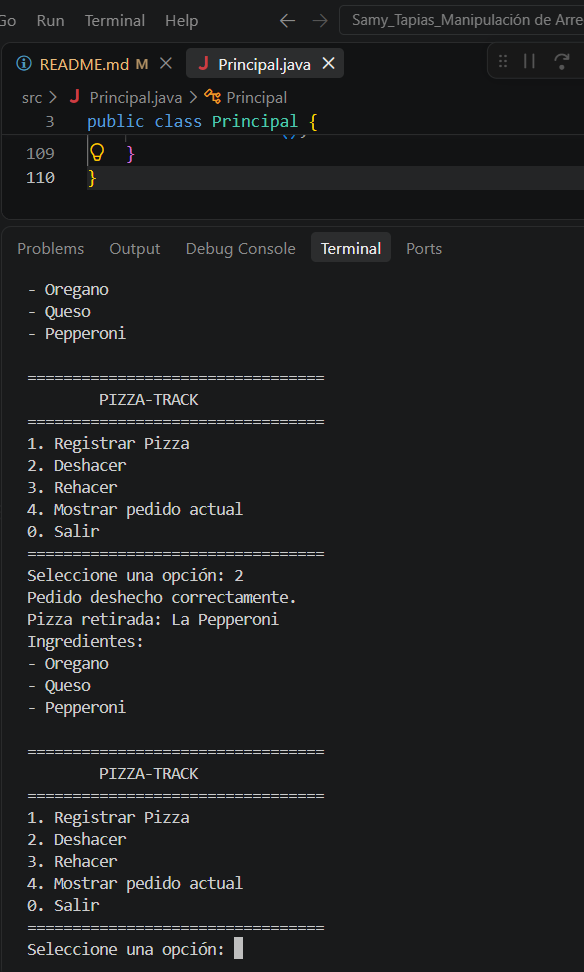
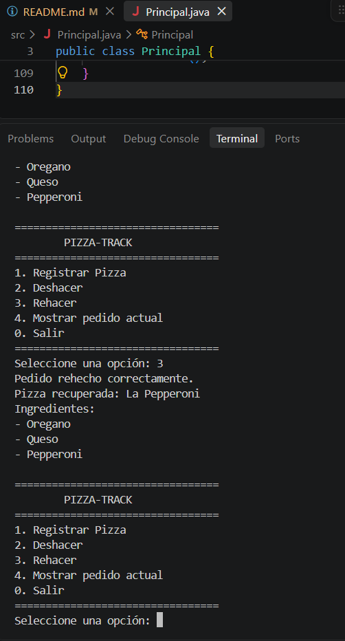
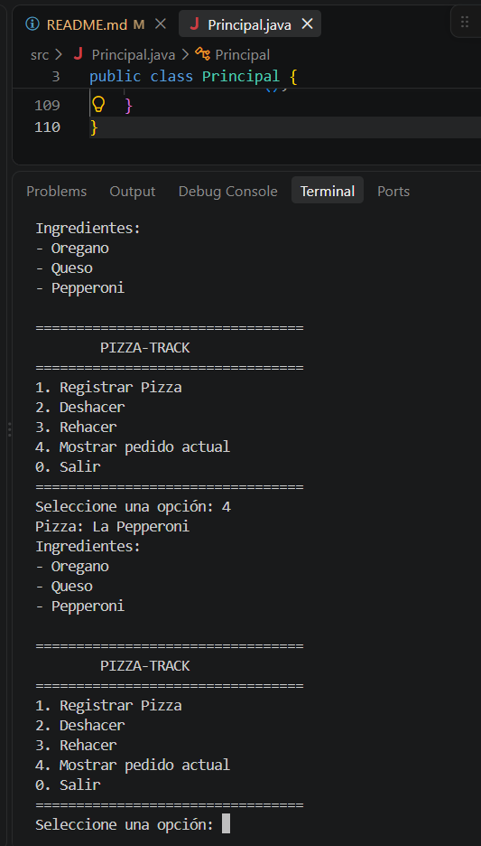
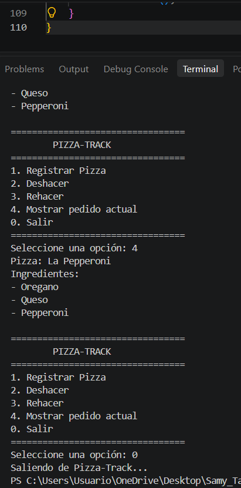

# 🍕 Pizza-Track

## Datos estudiantes

**Nombre:** Samy Mallerly Tapias Puerta Y Daniela Peña Arias

**Carrera:** Ingeniería en Software y Datos

**Evidencia:** Manipulación de Arreglos y Listas en Java

## Descripción

Pizza-Track es un programa desarrollado en **Java** que simula la gestión de pedidos de una pizzería utilizando **pilas manuales**.

El programa permite registrar pizzas, deshacer el último pedido realizado y rehacer un pedido que había sido deshecho. Para esto se utilizan dos pilas manuales implementadas mediante una estructura de lista enlazada.

Cada pizza contiene un nombre y un arreglo fijo de **3 ingredientes**.

## Objetivo

Comprender el funcionamiento de las **pilas manuales**, aplicando las operaciones `push()`, `pop()`, `peek()` e `isEmpty()` en un simulador de gestión de pedidos.

El proyecto también permite practicar el uso de **arreglos, listas enlazadas, programación orientada a objetos y control de versiones con GitHub**.

## Tecnologías utilizadas

- Java
- Visual Studio Code
- JDK Eclipse Temurin
- Git
- GitHub

## Estructura del proyecto

El proyecto está organizado de la siguiente manera:

```text
Samy_Tapias_Manipulación de Arreglos y Listas en Java/
├── src/
│   ├── Pizza.java
│   ├── Nodo.java
│   ├── Pila.java
│   ├── GestionPedidos.java
│   └── Principal.java
│
├── Capturas/
│   ├── Captura_1.png
│   ├── Captura_2.png
│   ├── Captura_3.png
│   ├── Captura_4.png
│   └── Captura_5.png
│
└── README.md
```

## Descripción de los archivos

- **Pizza.java:** representa una pizza y almacena su nombre y sus 3 ingredientes. También contiene el enlace hacia la siguiente pizza.
- **Nodo.java:** representa cada elemento de la lista enlazada utilizada para construir la pila. Cada nodo almacena una pizza y una referencia al siguiente nodo.
- **Pila.java:** implementa una pila manual mediante una lista enlazada y contiene las operaciones push(), pop(), peek() e isEmpty().
- **GestionPedidos.java:** administra las dos pilas manuales: una para los pedidos registrados y otra para los pedidos deshechos.
- **Principal.java:** contiene el menú principal y permite al usuario interactuar con el programa.


## Cómo ejecutar el programa

1. Abrir la carpeta de la tarea en Visual Studio Code.
2. Verificar que esté instalado el JDK Eclipse Temurin.
3. Abrir la carpeta `src`.
4. Abrir el archivo `Principal.java`.
5. Presionar el botón **Run** o ejecutar el programa desde la terminal.
5. Utilizar las opciones disponibles en el menú.

## Opciones del programa

1. **Registrar Pizza**

Permite ingresar el nombre de la pizza y exactamente 3 ingredientes.

La pizza se agrega al tope de la pila manual principal mediante `push()`.

2. **Deshacer**

Retira la última pizza registrada mediante `pop()` y la pasa a la segunda pila manual para poder recuperarla posteriormente.

3. **Rehacer**

Recupera la última pizza deshecha y la vuelve a colocar en la pila principal.

4. **Mostrar pedido actual**

Consulta la pizza que está en el tope mediante `peek()`, sin eliminarla.

0. **Salir**

Finaliza la ejecución del programa.

## Operaciones de la pila manual

El proyecto utiliza una pila manual, implementada mediante una lista enlazada. Las principales operaciones utilizadas son:

push() — Agregar

Coloca una nueva pizza en el tope de la pila.

pop() — Retirar

Saca la pizza que se encuentra en el tope de la pila.

peek() — Consultar

Permite consultar la pizza que está en el tope de la pila sin eliminarla.

isEmpty() — Comprobar

Verifica si la pila se encuentra vacía.

## Funcionamiento de Undo y Redo

Para realizar las funciones Deshacer (Undo) y Rehacer (Redo) se utilizan dos pilas manuales:

**Pila principal:** almacena los pedidos registrados.
**Pila de rehacer:** almacena temporalmente los pedidos que fueron deshechos.
Deshacer

Cuando se selecciona la opción Deshacer, se utiliza `pop()`para retirar la última pizza de la pila principal y luego`push()`para colocarla en la pila de rehacer.

Rehacer

Cuando se selecciona la opción Rehacer, se utiliz`pop()`para retirar la pizza de la pila de rehacer y luego`push()`para devolverla a la pila principal.

De esta manera se conserva el pedido completo, incluyendo su nombre y sus tres ingredientes.

## Capturas de pantalla

### 1. Registrar Pizza

Se selecciona la opción **Registrar Pizza**, se ingresa el nombre de la pizza y sus tres ingredientes.



### 2. Deshacer (Undo)

Se selecciona la opción **Deshacer (Undo)** para retirar el último pedido registrado de la pila principal.



### 3. Rehacer (Redo)

Se selecciona la opción **Rehacer (Redo)** para recuperar el pedido que fue deshecho.



### 4. Mostrar Pedido Actual

 Se selecciona la opción **Mostrar Pedido Actual** para visualizar la pizza que se encuentra en el tope de la pila, incluyendo sus ingredientes.



### 5. Salir

Se selecciona la opción **Salir** para finalizar la ejecución del programa.



## Video de sustentación

En el video se explica el funcionamiento del proyecto, incluyendo las operaciones principales de la pila manual como push(), pop(), peek() e isEmpty().

También se demuestra el funcionamiento del programa mediante el proceso de Registrar → Deshacer → Rehacer.